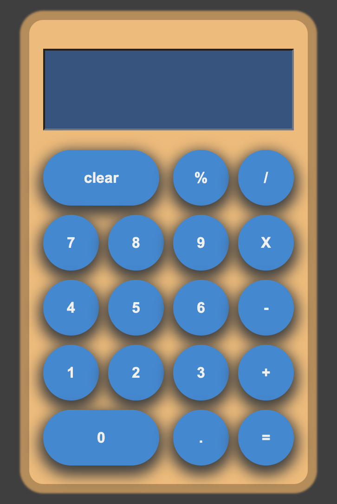
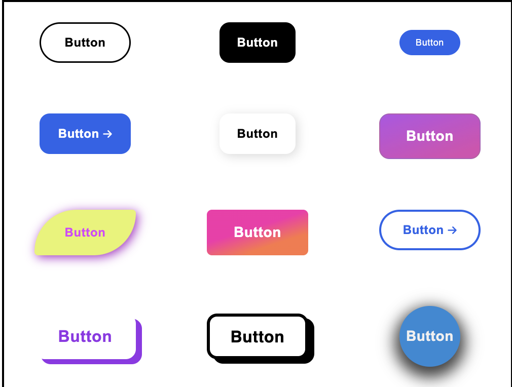

# Calculator & Buttons

The Calculator & Buttons page is a web browser calculator as well as a splash of button designs all built using html & css.

## Features
  - Standard functioning calculator with button feedback on click
  - List of various buttons for use on future projects

## To-dos
 - Add additional buttons / effects
 - Split calculator functionality into its own js script file
 - Refresh calculator buttons to differentiate between the header, numbers and operand buttons
 